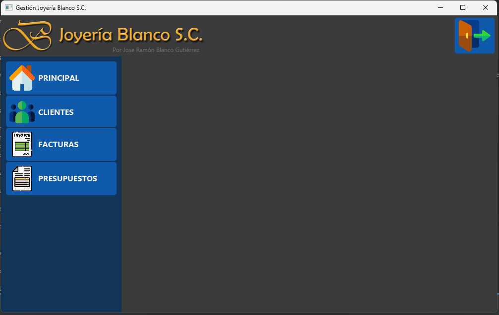

# Gestión JBlanco

Este es un proyecto de gestión desarrollado en Java, JavaFX y Maven.



## Descripción

El objetivo de este proyecto es desarrollar un sistema de gestión para JBlanco, una empresa especializada en joyería. El sistema permite a JBlanco administrar sus ventas, básicamnete las facturas.

## Características

- Interfaz de usuario intuitiva y fácil de usar, desarrollada con JavaFX.
- Gestión eficiente de las facturas.
- Registro y seguimiento de pedidos, con la capacidad de generar facturas y etiquetas de envío.
- Generación de informes de ventas y análisis de datos para tomar decisiones estratégicas.
- Integración con una base de datos para almacenar la información de manera segura y confiable.
- Utilización de Maven como herramienta de construcción y gestión de dependencias.

## Instalación

Para ejecutar el proyecto de forma local, sigue estos pasos:

1. Clona el repositorio a tu máquina local.
   ```
   git clone https://github.com/tu-usuario/gestion-jblanco.git
   ```

2. Asegúrate de tener instalado Java Development Kit (JDK) en tu máquina.

3. Abre una terminal y navega hasta el directorio raíz del proyecto.

4. Ejecuta el siguiente comando para compilar el proyecto y generar el archivo ejecutable:
   ```
   mvn clean package
   ```

5. Una vez compilado, puedes ejecutar la aplicación con el siguiente comando:
   ```
   java -jar target/gestion-jblanco.jar
   ```

## Contribuciones

Las contribuciones son bienvenidas. Si deseas mejorar este proyecto, por favor sigue estos pasos:

1. Haz un fork del proyecto.

2. Crea una nueva rama para tu contribución.
   ```
   git checkout -b feature/nueva-funcionalidad
   ```

3. Realiza los cambios y commitea tus modificaciones.
   ```
   git commit -m "Agrega nueva funcionalidad"
   ```

4. Haz push de tus cambios a tu repositorio fork.
   ```
   git push origin feature/nueva-funcionalidad
   ```

5. Abre una pull request en este repositorio para revisar tus cambios.

## Licencia

Este proyecto está licenciado bajo la [MIT License](LICENSE).