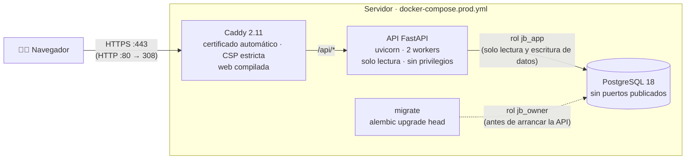

<div align="center">


# Joyería Blanco

**Gestión de clientes, facturación y presupuestos para Joyería Blanco, preparada para Verifactu.**

[](https://www.python.org/)
[](https://fastapi.tiangolo.com/)
[](https://www.postgresql.org/)
[](https://react.dev/)
[](https://www.typescriptlang.org/)
[](https://vite.dev/)
[](https://tailwindcss.com/)
[](https://docs.docker.com/compose/)
[](https://caddyserver.com/)

[Despliegue](#-despliegue-en-producción) ·
[Operación](#-operación-del-día-a-día) ·
[Desarrollo](#-desarrollo-local) ·
[Arquitectura](#-arquitectura) ·
[Documentación](#-documentación)

</div>

---

## ✨ Qué incluye

El proyecto avanza por features, cada una especificada en [`specs/`](specs/). Esta es la situación
actual:

| Módulo | Estado | Qué hace |
|---|:---:|---|
| **Acceso seguro** | ✅ | Sesiones de servidor, bloqueo por intentos, contraseñas robustas y caducidad por inactividad |
| **Clientes** | ✅ | Búsqueda sin tildes, filtros, indicadores y NIF validado según las reglas oficiales de la AEAT |
| **Usuarios y roles** | ✅ | Administrador y empleado; alta con contraseña temporal; desactivación y eliminación |
| **Auditoría** | ✅ | Registro inalterable de accesos y cambios, que se puede consultar desde la aplicación |
| **Facturas y registro Verifactu** | ✅ | Borradores y emisión en un modal, numeración correlativa sin huecos, registro de alta con huella SHA-256 encadenada e inalterable, anulación y rectificativas trazables, y comprobación de la cadena. IVA por defecto configurable a cualquier tipo, venta de oro de inversión sin IVA e IBAN del emisor en la factura |
| **PDF con QR y remisión a la AEAT** | 🔜 | PDF de la factura con el QR de cotejo (003) y envío o firma de los registros (004) |
| **Presupuestos** | 🔜 | Presupuestos con conversión a factura |

> [!NOTE]
> La aplicación está en español de España, usa un único tema oscuro y aplica el sistema de diseño
> [`docs/DESIGN.md`](docs/DESIGN.md), con el menú a la izquierda.

---

## 🏗️ Arquitectura

La web y la API se sirven desde el **mismo origen**, así que no hace falta CORS. En producción,
Caddy termina el HTTPS, sirve la web ya compilada y reenvía `/api` a la API. La base de datos no
es accesible desde fuera del servidor.


```mermaid
flowchart LR
    U["🧑‍💼 Navegador"] -->|"HTTPS :443<br/>(HTTP :80 → 308)"| C

    subgraph S["Servidor · docker-compose.prod.yml"]
        C["Caddy 2.11<br/>certificado automático · CSP estricta<br/>web compilada"]
        A["API FastAPI<br/>uvicorn · 2 workers<br/>solo lectura · sin privilegios"]
        M["migrate<br/>alembic upgrade head"]
        D[("PostgreSQL 18<br/>sin puertos publicados")]
        C -->|"/api/*"| A
        A -->|"rol jb_app<br/>(solo lectura y escritura de datos)"| D
        M -.->|"rol jb_owner<br/>(antes de arrancar la API)"| D
    end
```

| Pieza | Tecnología |
|---|---|
| **API** | Python 3.13, FastAPI, SQLAlchemy 2.1 (async), Alembic, Pydantic 2 y Argon2id |
| **Base de datos** | PostgreSQL 18 con `unaccent` y `pg_trgm` para la búsqueda |
| **Web** | React 19 con React Compiler, TypeScript 6, Vite 8, TanStack Router y Query, React Hook Form + Zod, Tailwind 4 y React Aria |
| **Proxy y TLS** | Caddy 2.11 con Let's Encrypt |
| **Calidad** | pytest contra PostgreSQL real, Vitest + MSW, Playwright, ruff, mypy estricto, ESLint y Prettier |

---

## 🚀 Despliegue en producción

### Requisitos

- **Un servidor Linux** con [Docker Engine](https://docs.docker.com/engine/install/) y el plugin
  Compose v2. **No hace falta instalar Node ni Python**: la web y la API se compilan dentro de las
  imágenes.
- **Un dominio o subdominio** propio, por ejemplo `gestion.tu-joyeria.es`.
- **Puertos abiertos** hacia Internet: `80/tcp`, `443/tcp` y `443/udp` (HTTP/3), además del de SSH
  para administrar. Nada más.
- `git` para descargar el código.

### 1. Apunta el dominio al servidor

Crea un registro **A** (y **AAAA** si el servidor tiene IPv6) con la IP pública del servidor.
Espera a que se propague (`dig +short gestion.tu-joyeria.es`) **antes de arrancar**: Caddy
necesita que el dominio ya resuelva para obtener el certificado.

### 2. Descarga el código

```bash
git clone https://github.com/jrcosio/joyeriablanco.git
cd joyeriablanco
```

### 3. Configura el entorno

```bash
cp .env.example .env
openssl rand -hex 32   # ejecútalo tres veces: una contraseña distinta para cada rol
```

Edita `.env` y rellena como mínimo estas variables:

| Variable | Valor | Para qué sirve |
|---|---|---|
| `DOMINIO` | `gestion.tu-joyeria.es` | Dominio público, sin `https://` |
| `TLS_MODO` | `acme` | Certificado de Let's Encrypt. `internal` es solo para la simulación local |
| `POSTGRES_PASSWORD` | aleatoria | Superusuario de PostgreSQL: inicialización y administración |
| `DB_OWNER_PASSWORD` | aleatoria | Rol `jb_owner`, dueño del esquema; ejecuta las migraciones |
| `DB_APP_PASSWORD` | aleatoria | Rol `jb_app`, el de la API: solo lee y escribe datos, no cambia la estructura |

El compose de producción **ya fija** `ENTORNO=produccion`, `ORIGEN_PERMITIDO=https://<DOMINIO>`,
`SESION_COOKIE_SEGURA=true`, `DB_HOST` y `DB_NAME`. No hace falta tocarlos. Los tiempos de sesión
y los umbrales de bloqueo tienen valores por defecto razonables y también se pueden ajustar en
`.env`.

> [!IMPORTANT]
> `.env` contiene secretos: no lo subas nunca al repositorio (ya está en `.gitignore`) y guarda una
> copia en un lugar seguro. Las contraseñas de la base de datos **se fijan la primera vez** que se
> crea su volumen. Cambiarlas después en `.env` no basta: sigue el
> [procedimiento de cambio](#cambiar-las-contraseñas-de-la-base-de-datos).

### 4. Arranca

```bash
docker compose -f docker-compose.prod.yml --env-file .env up -d --build
```

El primer arranque tarda unos minutos, porque descarga las imágenes y compila la web. Este es el
orden:

1. **`db`** crea los roles `jb_owner` y `jb_app` y la base `joyeriablanco`. Esto solo ocurre la
   primera vez que se crea el volumen.
2. **`migrate`** aplica las migraciones con `jb_owner` y termina.
3. **`api`** arranca con `jb_app` cuando las migraciones han terminado bien.
4. **`caddy`** obtiene el certificado, redirige HTTP a HTTPS y empieza a servir.

Comprueba que todo está en marcha:

```bash
docker compose -f docker-compose.prod.yml ps
```

### 5. Crea el primer administrador

```bash
docker compose -f docker-compose.prod.yml exec api joyeria crear-admin --usuario jefa --nombre "Nombre Apellido"
```

El comando muestra **una sola vez** una contraseña temporal, válida durante 72 horas. Entrégala en
persona. Al entrar por primera vez en `https://<DOMINIO>`, la aplicación obliga a cambiarla.
Desde ahí, el resto de usuarios se crean en **Configuración → Usuarios**.

### 6. Verifica el despliegue

Ejecuta el script en el propio servidor, desde la raíz del repositorio:

```bash
deploy/verificar-produccion.sh gestion.tu-joyeria.es
```

Comprueba 13 puntos, entre ellos:
- La redirección de HTTP a HTTPS.
- Las cabeceras HSTS y CSP (sin `unsafe-inline`), `nosniff`, `Referrer-Policy` y
  `Permissions-Policy`.
- Que la documentación de la API esté desactivada.
- Que la base de datos no publique puertos.

Debe terminar con **"Todas las comprobaciones han pasado"**.

Para completar la validación, pasa un análisis público de TLS, como
[SSL Labs](https://www.ssllabs.com/ssltest/). El objetivo es una calificación **A o superior**.

> [!WARNING]
> **Configura las copias de seguridad antes de cargar datos reales.** El sistema aún no las
> automatiza, y los datos de facturación tienen obligación legal de conservación. Más abajo tienes
> un [procedimiento manual ya probado](#copias-de-seguridad).

<details>
<summary><b>🧪 Ensayo general en tu equipo antes de desplegar</b></summary>

<br>

Se puede levantar la pila de producción completa en local, con la CA interna de Caddy en lugar de
Let's Encrypt. Necesita los puertos 80 y 443 libres.

```bash
cp .env.example .env    # si aún no existe
DOMINIO=localhost TLS_MODO=internal docker compose -f docker-compose.prod.yml --env-file .env up -d --build
deploy/verificar-produccion.sh localhost
docker compose -f docker-compose.prod.yml exec api joyeria crear-admin --usuario jefa --nombre "Jefa"
# → https://localhost (el navegador avisará del certificado de la CA interna)

docker compose -f docker-compose.prod.yml down -v   # al terminar: borra también los datos del ensayo
```

</details>

---

## 🛠️ Operación del día a día

Todos los comandos se ejecutan en el servidor, desde la raíz del repositorio. Para abreviar:

```bash
alias jb='docker compose -f docker-compose.prod.yml --env-file .env'
```

### Actualizar a una versión nueva

```bash
git pull
jb up -d --build
```

Se reconstruyen las imágenes, `migrate` aplica las migraciones pendientes (si no hay, no hace
nada) y la API y Caddy se reinician con el código nuevo. Los datos viven en volúmenes y no se
tocan.

> [!TIP]
> Haz una [copia de seguridad](#copias-de-seguridad) justo antes de cada actualización.

### Registros y estado

```bash
jb ps                       # estado y salud de los servicios
jb logs -f api              # registros de la API en JSON (sin contraseñas, tokens ni datos personales)
jb logs -f caddy            # certificados y peticiones
```

### Comandos de administración

La API incluye la CLI `joyeria`:

```bash
jb exec api joyeria --help
```

| Comando | Para qué |
|---|---|
| `crear-admin --usuario U --nombre "N"` | Crea un administrador con contraseña temporal |
| `restablecer-admin --usuario U` | **Último recurso** si ningún administrador puede entrar: genera una contraseña temporal nueva, levanta el bloqueo y cierra sus sesiones |
| `purgar-sesiones` | Borra las sesiones caducadas hace más de 30 días. También se hace sola en cada arranque de la API |
| `verificar-cadena` | Comprueba la cadena de registros de facturación y los documentos: huellas, encadenamiento, contenido y totales. Termina con código 1 y señala el primer registro discrepante si algo no cuadra |

`cargar-datos-ejemplo` se niega a ejecutarse en producción.

Todo lo que se hace desde la consola queda en la auditoría con el actor **"Consola"**.

### Copias de seguridad

Mientras no haya copias automáticas, este es el procedimiento manual mínimo.

> [!NOTE]
> Se probó el 2026-09-28. La copia restaurada conservó:
> - Todos los datos.
> - La propiedad de las tablas por `jb_owner` y los permisos de `jb_app`.
> - La inalterabilidad de la auditoría: los triggers siguieron impidiendo `UPDATE` y `DELETE`.

**Hacer una copia**, en el formato comprimido de `pg_dump`:

```bash
mkdir -p ~/copias
jb exec -T db sh -c 'pg_dump -U "$POSTGRES_USER" -d joyeriablanco -Fc' > ~/copias/joyeriablanco-$(date +%F-%H%M).dump
```

Guarda las copias **fuera del servidor** (otro equipo, almacenamiento externo o en la nube) y
comprueba de vez en cuando que se pueden restaurar.

**Automatizarla con cron**, como ejemplo. En `crontab` el `%` se escapa:

```cron
0 3 * * * cd /ruta/a/joyeriablanco && docker compose -f docker-compose.prod.yml --env-file .env exec -T db sh -c 'pg_dump -U "$POSTGRES_USER" -d joyeriablanco -Fc' > $HOME/copias/joyeriablanco-$(date +\%F).dump
```

**Restaurar** en un servidor nuevo, o tras perder el volumen de datos:

```bash
jb up -d db                  # SOLO la base de datos: crea los roles y la base vacía
jb ps db                     # espera a que aparezca como (healthy)
jb exec -T db sh -c 'pg_restore -U "$POSTGRES_USER" -d joyeriablanco --exit-on-error' < ~/copias/joyeriablanco-AAAA-MM-DD.dump
jb up -d --build             # migrate (sin cambios pendientes), api y caddy
```

> [!CAUTION]
> Se restaura sobre una base **recién creada**, antes de que `migrate` cree las tablas. Usa el mismo
> `.env` (o las mismas contraseñas) que tenía el sistema original.

### Cambiar las contraseñas de la base de datos

Las contraseñas se guardan en PostgreSQL al crear el volumen. Para cambiar la de `jb_app`
(procedimiento probado el 2026-09-28: la nueva se acepta y la antigua se rechaza):

```bash
NUEVA=$(openssl rand -hex 32)   # hexadecimal: sin comillas ni caracteres que escapar
printf "ALTER ROLE jb_app PASSWORD '%s';\n" "$NUEVA" | jb exec -T db sh -c 'psql -v ON_ERROR_STOP=1 -U "$POSTGRES_USER" -d postgres'
echo "$NUEVA"                   # cópiala en DB_APP_PASSWORD de .env
jb up -d --force-recreate api
```

Para `jb_owner` es igual: se actualiza `DB_OWNER_PASSWORD` y se recrean `migrate` y `api`. Para el
superusuario, se cambia con `ALTER ROLE` y se actualiza `POSTGRES_PASSWORD`.

### Parar el sistema

```bash
jb down        # para los servicios y conserva los datos y los certificados
```

> [!CAUTION]
> `jb down -v` **borra los volúmenes**, es decir, la base de datos y los certificados. No lo uses
> en producción salvo que quieras empezar de cero.

<details>
<summary><b>🧯 Solución de problemas</b></summary>

<br>

| Síntoma | Causa probable y solución |
|---|---|
| El navegador no conecta o no hay certificado | El dominio aún no apunta al servidor, o los puertos 80 y 443 están cerrados. Revisa `jb logs caddy`. Caddy reintenta solo cuando se corrige |
| `Falta DOMINIO` (o `Falta …`) al arrancar | Falta esa variable en `.env`, o no se pasó `--env-file .env` |
| "Origen de la petición no permitido" al iniciar sesión | Se entra por una dirección distinta de `https://<DOMINIO>`. La API solo acepta peticiones de su propio origen |
| La API no arranca: error de autenticación con la base de datos | Se cambiaron contraseñas en `.env` después de crear el volumen. Aplica el [procedimiento de cambio](#cambiar-las-contraseñas-de-la-base-de-datos) o restaura las contraseñas originales |
| `migrate` termina con error | Consulta `jb logs migrate`. La API no arranca hasta que las migraciones terminan bien, así que no se sirve nada a medio migrar |
| Un usuario está bloqueado | El bloqueo dura 15 minutos tras 5 fallos. Un administrador puede levantarlo al restablecerle la contraseña en Configuración → Usuarios |
| Ningún administrador puede entrar | `jb exec api joyeria restablecer-admin --usuario <usuario>` |

</details>

---

## 💻 Desarrollo local

**Requisitos**:
- Docker con Compose v2.
- [`uv`](https://docs.astral.sh/uv/) 0.12 o superior, que instala Python 3.13.
- Node.js 26.

```bash
cp .env.example .env
docker compose up -d --build                           # db + api con recarga automática
docker compose exec api alembic upgrade head
docker compose exec api joyeria crear-admin --usuario admin --nombre "Administrador"
docker compose exec api joyeria cargar-datos-ejemplo   # usuarios *.demo, 40 clientes y unas 50 facturas ficticias

cd joyeriablanco_web
npm ci
npm run dev                                            # → http://localhost:5173
```

| Servicio | Dirección |
|---|---|
| Web (Vite, con proxy de `/api`) | http://localhost:5173 |
| API | http://localhost:8000 |
| Documentación interactiva de la API (solo en desarrollo) | http://localhost:8000/api/docs |
| PostgreSQL (solo desde el propio equipo) | `127.0.0.1:5432` |

### Pruebas y calidad

```bash
# Backend (en backend/): usa la base joyeriablanco_test del servicio db
uv run ruff check . && uv run ruff format --check . && uv run mypy . && uv run pytest

# Web (en joyeriablanco_web/)
npm run lint && npm run typecheck && npm run test && npm run build && npm run check:tokens

# Extremo a extremo: levanta su propia API (puerto 8001) y su propia base de datos
npx playwright install chromium   # solo la primera vez
npx playwright test
```

Tras cambiar la API, se regeneran los tipos de la web con:

```bash
uv --directory ../backend run joyeria exportar-openapi && npm run gen:api
```

---

## 🔐 Seguridad

- **Sesiones**:
  - Sesiones de servidor, no JWT, en una cookie `__Host-jb_sesion` con `HttpOnly`, `Secure` y
    `SameSite=Strict`.
  - En la base de datos solo se guarda la huella del token.
  - Caducan tras 30 minutos de inactividad y, en cualquier caso, a las 10 horas.
- **CSRF**: token sincronizador en cada petición que modifica datos, más la comprobación del
  `Origin`.
- **Contraseñas**:
  - Hash Argon2id.
  - Entre 12 y 128 caracteres, sin reglas de composición y rechazando las 100.000 más comunes.
  - La contraseña temporal caduca a las 72 horas.
- **Fuerza bruta**:
  - Bloqueo de la cuenta 15 minutos tras 5 fallos.
  - Límite de 20 intentos cada 10 minutos por origen.
  - Mensaje de error genérico, para no revelar qué usuarios existen.
- **Autorización**:
  - Todo se deniega salvo lo permitido, y lo comprueba siempre la API.
  - El sistema no puede quedarse nunca sin un administrador activo.
- **Auditoría inalterable**: los permisos y los triggers de la base de datos impiden modificarla
  o borrarla, incluso con las credenciales del propietario de los datos.
- **Base de datos con privilegio mínimo**: la API usa un rol que solo lee y escribe datos. El que
  cambia la estructura solo lo usan las migraciones.
- **Transporte**:
  - HTTPS obligatorio con HSTS.
  - CSP estricta sin `unsafe-inline`.
  - Tipografías servidas desde el propio servidor, sin llamadas a terceros.
- **Contenedores**:
  - Sin usuario root, con el sistema de archivos de la API en solo lectura.
  - `cap_drop: ALL` y `no-new-privileges`.

---

## 📁 Estructura del repositorio

```
.
├── backend/                 API REST · FastAPI + SQLAlchemy + Alembic (uv)
│   ├── app/                 routers → services → repositories → models · domain/ (reglas puras)
│   ├── alembic/             migraciones escritas a mano
│   └── tests/               unitarios e integración contra PostgreSQL real
├── joyeriablanco_web/       web de gestión · React + TypeScript + Vite
│   ├── src/                 features/, routes/, components/, api/ (tipos generados)
│   └── e2e/                 recorridos de Playwright
├── deploy/                  Caddy (Caddyfile, Dockerfile) y verificar-produccion.sh
├── infra/db/init/           creación de roles y bases al inicializar PostgreSQL
├── docs/DESIGN.md           sistema de diseño normativo
├── specs/                   una carpeta por feature (spec, plan, contratos, tareas…)
├── .specify/                Spec Kit: constitución, plantillas y scripts
├── docker-compose.yml       desarrollo (db, api y api-e2e)
└── docker-compose.prod.yml  producción (db, migrate, api y caddy)
```

---

## 📚 Documentación

| Documento | Contenido |
|---|---|
| [`specs/001-cimientos-clientes/quickstart.md`](specs/001-cimientos-clientes/quickstart.md) | Guía de puesta en marcha y validaciones manuales, con mediciones de rendimiento |
| [`specs/002-facturas/quickstart.md`](specs/002-facturas/quickstart.md) | Validación de la facturación, con la medición de rendimiento sobre 20.000 facturas |
| [`specs/001-cimientos-clientes/spec.md`](specs/001-cimientos-clientes/spec.md) · [`specs/002-facturas/spec.md`](specs/002-facturas/spec.md) | Requisitos funcionales y criterios de éxito de cada feature |
| [`specs/002-facturas/research.md`](specs/002-facturas/research.md) | Decisiones de Verifactu con sus fuentes oficiales de la AEAT (versión y SHA-256) y las preguntas abiertas para la asesoría |
| [`specs/001-cimientos-clientes/contracts/openapi.yaml`](specs/001-cimientos-clientes/contracts/openapi.yaml) · [`specs/002-facturas/contracts/openapi.yaml`](specs/002-facturas/contracts/openapi.yaml) | Contrato de la API (la API implementa exactamente su unión) |
| [`docs/DESIGN.md`](docs/DESIGN.md) | Sistema de diseño: colores, tipografías y componentes |
| [`.specify/memory/constitution.md`](.specify/memory/constitution.md) | Principios del proyecto, que mandan sobre cualquier otra guía |
| [`CLAUDE.md`](CLAUDE.md) | Guía operativa de desarrollo y reglas innegociables de Verifactu |

### 🤝 Cómo se trabaja

Todo cambio pasa por **Spec Kit (desarrollo guiado por especificaciones)**, con una rama por
feature (`NNN-nombre-feature`):

```
specify → clarify → plan → checklist → tasks → analyze → implement
```

Ninguna feature se cierra sin sus pruebas en verde. Los detalles están en [`CLAUDE.md`](CLAUDE.md).
